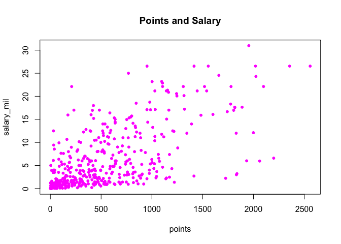
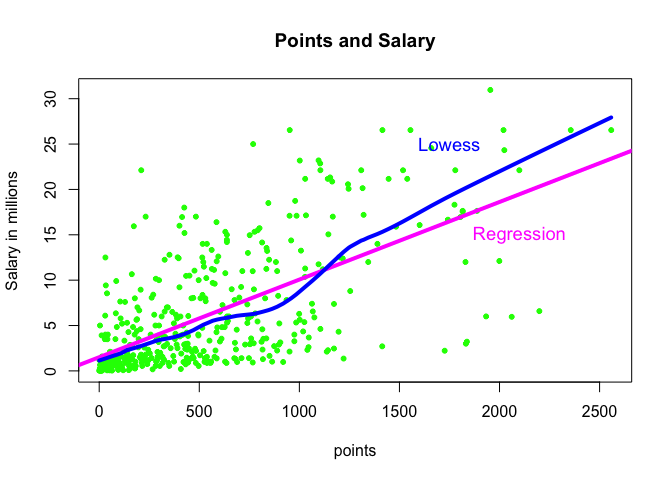
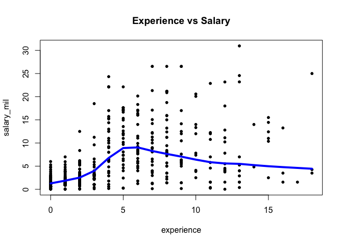
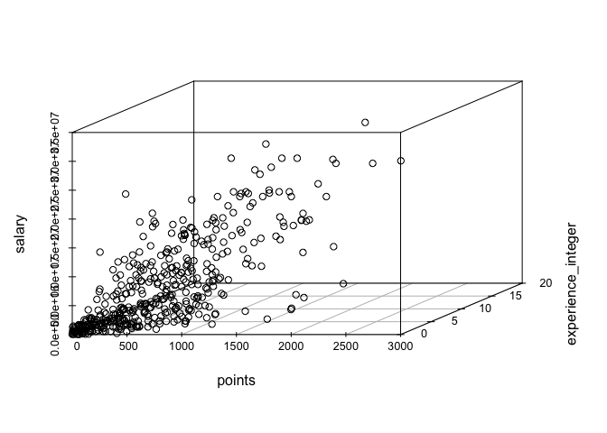
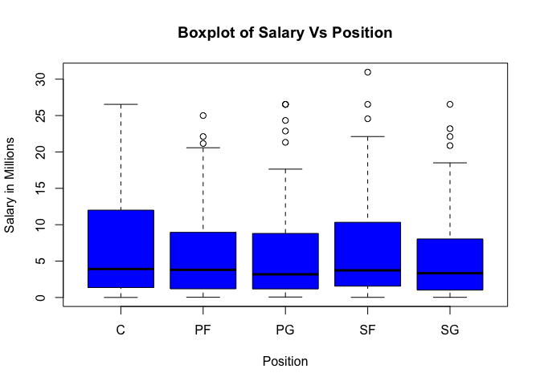

hw01-Alexander-Jou
================

``` r
#load data file
load("data/nba2017-salary-points.RData")
```

``` r
ls()
```

    ## [1] "experience" "player"     "points"     "points1"    "points2"   
    ## [6] "points3"    "position"   "salary"     "team"

A bit of data preprocessing
===========================

``` r
#salary in millions
salary_mil= salary/1000000
salary_mil
```

    ##   [1] 26.540100 12.000000  8.269663  1.450000  1.410598  6.587132  6.286408
    ##   [8]  1.825200  4.743000  5.000000  1.223653  3.094014  3.578880  1.906440
    ##  [15]  8.000000  7.806971  0.018255  0.259626  0.268029  0.005145  9.700000
    ##  [22] 12.800000  1.551659  0.543471 21.165675  5.239437 17.638063 30.963450
    ##  [29]  2.500000 15.330435  1.589640  7.330000  1.577280 26.540100 14.200000
    ##  [36]  0.543471  2.703960 14.382022 12.000000  1.921320  0.874636  5.300000
    ##  [43]  1.196040  6.050000 12.250000  3.730653 22.116750  1.200000  1.191480
    ##  [50]  0.543471 15.944154  5.000000 16.957900 12.000000  7.400000  5.893981
    ##  [57]  0.543471  2.870813  3.386598  1.499760  2.708582 23.180275  8.400000
    ##  [64]  0.392478 15.730338  4.000000  2.500000  4.837500  1.015696 20.072033
    ##  [71]  0.418228  3.850000  2.281605  2.995421 17.100000  5.374320  1.551659
    ##  [78] 12.517606 15.200000  0.925000  9.607500  1.403611 10.500000  1.811040
    ##  [85]  6.348759  2.568600  2.368327  2.700000 10.230179  4.583450  0.650000
    ##  [92]  8.800000  1.052342  1.800000  4.000000  4.000000 10.770000  2.463840
    ##  [99] 18.314532  1.052342 14.153652  3.488000  1.453680  2.112480  0.874636
    ## [106]  2.092200 23.200000  1.015696  1.643040 17.552209  1.709720  3.183526
    ## [113]  5.782450  0.750000 14.000000 13.219250  2.898000 15.890000 22.116750
    ## [120]  4.000000  5.782450  0.874636  2.593440  1.227000  0.210995  0.543471
    ## [127]  5.628000  4.000000  6.000000  1.015696 22.116750  6.500000  1.551659
    ## [134]  7.000000  0.874060  1.704120  6.000000 10.991957  3.678319  4.625000
    ## [141]  0.650000  2.255644 14.956522  2.969880 17.200000  1.050961  0.102898
    ## [148]  0.874636  5.318313  2.730000  6.511628  0.161483 12.000000  6.333333
    ## [155] 12.250000 13.000000 12.500000 20.869566  6.000000  0.543471 24.559380
    ## [162]  0.143860 11.242000 21.323250 17.000000  1.015696  4.317720  3.900000
    ## [169]  6.191000  0.543471  0.543471  2.898000  0.543471  1.410598  1.375000
    ## [176]  4.351320 17.000000  5.000000  7.250000  0.980431  2.613600 17.000000
    ## [183] 15.000000  6.540000  0.031969  3.909840 11.750000  0.031969  0.950000
    ## [190] 10.000000  0.031969  2.318280  9.000000  4.788840  9.424084  4.826160
    ## [197]  1.514160  2.993040  1.025831  1.015696  8.000000  0.089513  0.874636
    ## [204]  8.550000  1.326960  6.088993  0.119494 21.165675  1.562280  1.074145
    ## [211] 11.483254  0.980431  3.000000  3.333333  1.790902  2.500000  1.395600
    ## [218]  0.980431  0.726672  9.250000 11.131368  1.171560  1.551659 15.330435
    ## [225]  1.015696  0.980431  1.403611 26.540100  1.182840 16.663575  0.383351
    ## [232]  0.543471  5.782450 12.112359  2.898000  0.543471 10.000000  1.551659
    ## [239]  0.543471  1.180080  2.898000  0.165952  0.874636 17.638063  1.192080
    ## [246] 20.575005 14.000000  3.578948 15.500000 14.445313  0.680534  0.543471
    ## [253]  1.296240 12.385364  0.255000 26.540100  0.543471  7.000000  1.000000
    ## [260]  6.000000 18.735364  1.720560  7.806971  0.150000  1.315448 11.000000
    ## [267] 20.140838  1.551659  1.273920 22.868828 21.165675  0.543471  7.377500
    ## [274] 13.253012  2.203000  1.403611  3.500000  1.551659  5.628000 10.154495
    ## [281]  7.000000  3.940320 11.050000  8.000000 16.073140  1.015696  2.250000
    ## [288] 11.000000  0.600000  0.937800  1.406520  2.121288  2.433334  2.340600
    ## [295]  5.994764  2.183072  2.440200  2.483040 17.145838  0.980431  1.191480
    ## [302]  4.837500  3.750000  0.247991 26.540100  0.543471  3.140517  8.950000
    ## [309]  6.552960  0.945000  5.700000 22.116750  1.369229  2.898000  0.980431
    ## [316]  1.286160 21.165675 26.540100  5.505618  3.332940  4.264057  1.793760
    ## [323]  0.083119 10.361445  7.680965 18.500000  3.219579 24.328425  6.666667
    ## [330] 16.393443  0.600000  1.921320  8.988764  9.213484  2.751360  0.874636
    ## [337]  1.350120  0.543471 15.050000  8.070175  3.241800  1.655880  3.210840
    ## [344]  4.540525  1.987440 12.078652  1.627320  2.328530  3.500000  1.358500
    ## [351]  5.000000  3.533333 11.200000  4.600000 22.116750  0.020580  0.543471
    ## [358]  2.978250 16.957900  0.576724  8.081363  0.173094 11.286518  9.904494
    ## [365]  0.063938 11.241218  2.090000  0.650000  1.015696  4.228000 25.000000
    ## [372]  0.543471  8.375000 22.116750  4.096950  0.063938  4.384490  0.543471
    ## [379]  0.874636  2.898000 17.100000  0.207798  8.000000 12.500000  4.008882
    ## [386]  3.517200  5.229454  8.000000  2.202240  8.046500  5.200000  1.439880
    ## [393] 13.333333  1.188840  1.315448 10.661286  3.551160  2.022240  6.006600
    ## [400]  3.500000  7.643979  2.348783  3.911380  5.960160  3.872520  3.800000
    ## [407]  0.138414 13.550000  3.046299  1.339680  2.240880  5.281680  7.600000
    ## [414]  5.332800  0.073528  1.034956 12.500000  3.267120  1.207680 18.000000
    ## [421]  1.551659  5.443918  6.191000  1.050961 16.000000  1.733880  0.874636
    ## [428]  4.823621 12.606250  0.543471  2.223600  4.276320  0.023069 14.000000
    ## [435] 10.470000  4.000000  2.941440  0.282595  2.128920  0.918369 12.415000

``` r
experience_integer = as.integer(replace(experience, experience == "R" , 0))
experience_integer
```

    ##   [1]  9 11  6  0  9  5  4  2  0  6  1  3  2  1  4 10 12 11  5  1  5 12 13
    ##  [24]  0  8 13  5 13 15  5  2  5  1  7  7  0  0  4 10  2  1  5  0  6  7  2
    ##  [47]  4  7  1  0  8  8  6  9  5  3  0  0  3  0  3 12  8 11  4 12  0 14  3
    ##  [70] 10  3 10  3  3  6  2 17  4  4  0  3  8  4  1  9  0  3  8 12 11  0  7
    ##  [93]  1  6  6  5 11  1  6  1  9  8  1  1  1  0 13  3  1  5  2  3  2  0 10
    ## [116]  8  4  8  4  7  9  1  1  6  0  0  2 13  7  1  4  4 12  1  1  0  6  5
    ## [139]  3  5  0  3  5  1  5  4  1  1  3  1  4  2  5  9 11  4  4  8  9  0 13
    ## [162]  0  8  7  9  3  1  4  5  0  0  0  0  9  0  2  5  9  8  2  2  4  8  7
    ## [185]  0  1  5  0  0  4  0  0  7  1  8  0  1  2  1  3  4  0  1  6  0  4  3
    ## [208]  8  0  0  6  2  2  2  4 10  1  2  2  6 12  0 13  4  3  2  8  9  1  5
    ## [231] 13  0 11  7 13  0  7 11  0  0  3  9  1  5  2 10 14  7 15 15  2  0  2
    ## [254]  8  0  7  0 11  1  4  8  1 12  0  7  4  6 11  0 11  8  0 10 16  8  8
    ## [277] 18 11  6  5 13  1  6  8  6  3  2 15  0  1  2  3  5  1  0  3  0  2  5
    ## [300]  2  1  4 12  5  8  0  3  7  3  0  8  5  0  2  2  1  8  9 12  3 18  0
    ## [323]  0 15  6  3  3  4  6  6  0  2  4  4  2  1  2  0  7  7  1  2  0 12  0
    ## [346]  5  0  3 16  1  8  4  8  6  4  1  0  7  6  4  5  4  7  6  0  3  2  0
    ## [369]  3 12 18  0  2  4 10  0  2  0  1  3  7  0  8  9  3  0  7  6  0  8  2
    ## [392]  0 10  0  7  7  1  2  2  8  6  3  7  1  0  1  7  5  3  1  2  0  9  1
    ## [415]  0  0  2  2  1 12 16  9  2  4  6  2  1  3  5  0  1  0  2  6  9 13  0
    ## [438] 11  2  0 15

``` r
fposition = factor(position, labels = c("center", "power forward", "small forward", "shooting gaurd", "point gaurd"))
table(fposition)
```

    ## fposition
    ##         center  power forward  small forward shooting gaurd    point gaurd 
    ##             89             89             85             83             95

Scatterplot of Points and Salary
================================

``` r
plot(points, salary_mil , xlab="points" , ylab= "salary_mil", main = "Points and Salary", pch = 20, cex= 1, col= "magenta")
```

 \#Correlation between Points and Salary

``` r
n = length(points)
n
```

    ## [1] 441

``` r
x = sum(points)/n
x
```

    ## [1] 546.6054

``` r
y = sum(salary_mil)/n
y
```

    ## [1] 6.187014

``` r
var_x= (1/(n-1))*sum((points-x)^2)
var_x
```

    ## [1] 239136.2

``` r
var_y = (1/(n-1))* sum((salary_mil-y)^2)
var_y
```

    ## [1] 43.18973

``` r
sd_x = sqrt(var_x)
sd_x
```

    ## [1] 489.0156

``` r
sd_y = sqrt(var_y)
sd_y
```

    ## [1] 6.57189

``` r
cov_x_y = (1/(n-1))*sum((points-x)*(salary_mil-y))
cov_x_y
```

    ## [1] 2046.213

``` r
cor_X_Y = (cov_x_y)/((sd_y)*(sd_x))
cor_X_Y
```

    ## [1] 0.6367043

Simple Linear Regression
========================

``` r
b1 = cor_X_Y * (sd_y/sd_x)
b1
```

    ## [1] 0.008556681

``` r
b0 = y - (b1 * x)
b0
```

    ## [1] 1.509886

``` r
Yfit = b0 + (b1 * points)
```

Answers to the following questions
==================================

``` r
summary(Yfit)
```

    ##    Min. 1st Qu.  Median    Mean 3rd Qu.    Max. 
    ##   1.510   2.845   5.206   6.187   8.184  23.398

The regression equation is a line based off all the points that predicts where a y value will be, given the x value.
====================================================================================================================

The equation is Yfit = b0 + (b1 \* points)
==========================================

The slope coefficient b1 tells us how much we can expect in a increase in salary (in millions) for a one point score increase.
==============================================================================================================================

The intercept term b0 is how much we would expect a player to make if they scored 0 points.
===========================================================================================

Predicted Salaries:
===================

``` r
b0
```

    ## [1] 1.509886

``` r
b0 + (b1 *100)
```

    ## [1] 2.365554

``` r
b0 + (b1 * 500)
```

    ## [1] 5.788226

``` r
b0 + (b1 *1000)
```

    ## [1] 10.06657

``` r
b0 + (b1 *2000)
```

    ## [1] 18.62325

Plotting the Linear Regression Line
===================================

``` r
plot(points, salary_mil,xlab = "points", ylab= "Salary in millions", main= "Points and Salary", col = "green", pch = 20, cex =1)

abline(a = b0, b= b1, col = "magenta", lwd = 4)
text(2100, 15, col = "magenta", cex= 1.15, "Regression")

lines(lowess(points, salary_mil, f=.3), col = "blue", lwd = 4)
text(1750, 25, col= "blue" , cex = 1.15, "Lowess")
```

 \#Regression Residuals and Coefficient of Determination R^2

``` r
e = salary_mil - Yfit
summary(e)
```

    ##    Min. 1st Qu.  Median    Mean 3rd Qu.    Max. 
    ## -14.190  -2.794  -1.095   0.000   2.555  18.810

``` r
RSS = sum(e^2)
RSS
```

    ## [1] 11299.62

``` r
TSS = sum((salary_mil - y) ^ 2)
TSS
```

    ## [1] 19003.48

``` r
R2 = 1 - (RSS / TSS)
R2
```

    ## [1] 0.4053923

Exploring Position and Experience
=================================

``` r
plot(experience_integer, salary_mil, xlab = "experience", ylab = "salary_mil", main =  "Experience vs Salary", col = "black", pch = 20, cex = 1 )
lines(lowess(experience_integer, salary_mil, f=.3), col = "blue", lwd = 4)
```



``` r
#It looks like from 0-5 years the salary increases every year but after that it decreased for every year in experience. No first or second year players make over 10 million. From this scatterplot it seems experience is somewhat related to salary but not a high correlation. 
```

``` r
library("scatterplot3d") 
```

``` r
scatterplot3d(points, experience_integer, salary, pch = 1)
```



``` r
#From this scatterplot it seems that salary isn't too correlated to salary besides most rookies making little amounts of money. There is more of a relation between points and salary as most players that score a lot of points have high salaries. Most players are clubped near the bottom in terms of points, salary, and experience with a few far outliers in each.
```

``` r
boxplot (salary_mil ~ position, col = "blue", xlab = "Position", ylab = "Salary in Millions", main = "Boxplot of Salary Vs Position")
```



``` r
#The average salary for each position is about the same but the upper quartile for centers is the highest with point guard having the lowest upper quartile. The minimum is the same for all positions with a few outliers for each position except for center. Position is somewaht related to salary but not a high correlation.
```

``` r
#Comments and Reflections

#The hardest part was formatting the graphs because I didn't quite know what scales and font sizes to use. 

#Writing the formulas and computing equations were easier because it was simliar to typing it into a calculator.

#I used git for the last lab and I feel more conifdent with it now.

#I used GitHub for the last lab as well and I understand how to commit files to it now. 

#I looked online a lot for help on certain commands and syntax as I sometimes forgot how to properly format my code.

#It took be about 4 hours to complete this homework.

#The most time consuming part was the graphs.

#I still think I need to learn the basic syntax rules as I often forget commas and parentheses in my arguments.

#The most frustrating part was my code not working because I was missing something small in the syntax.

#I'm proud that I finished my first homework assignment and actually picked up a lot of information.
```
