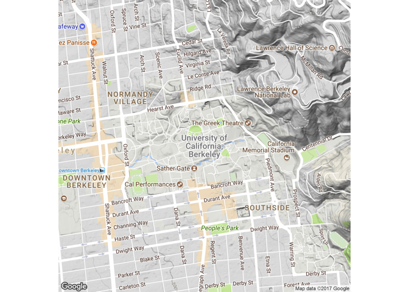
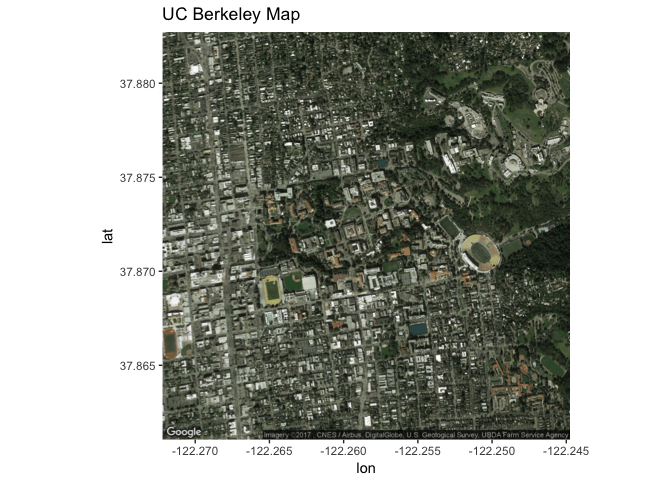
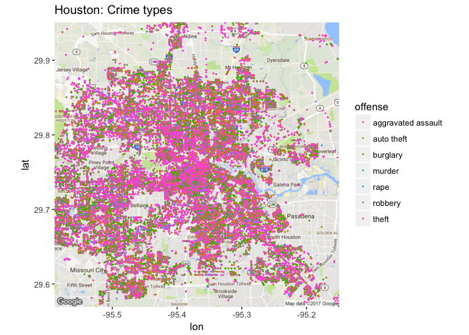
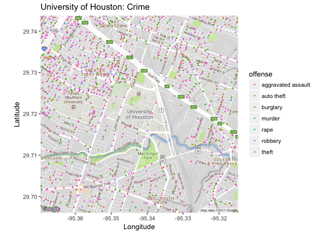
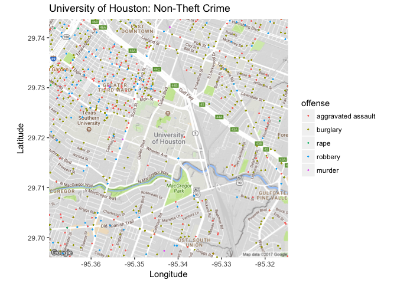
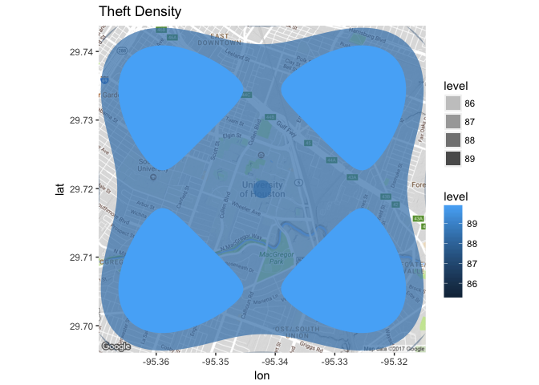
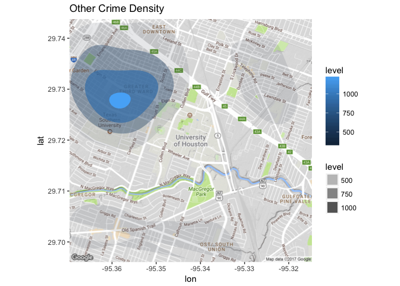

October Post: Working with ggmaps
================
Alexander Jou

> ### What is ggmaps? Why do we use it?
>
> The ggmaps package is the primary tool for working with online sources such as Google Maps and Stamen Maps and extracting data from them. It is the best way to use ggplot2 to work with mapping technologies on the internet. In this post you will learn how to use ggmaps and how to apply it to learn more about geographical trends. The purpose of this is to show an extension of the use of ggplot on something that we have not touched on in class but can be very useful in the future. Link to the full package: <https://cran.r-project.org/web/packages/ggmap/ggmap.pdf>.

------------------------------------------------------------------------

### Installing ggmaps

First we must install the package and get it on to our working directory (make sure you already have "ggplot2" on your directory before you do this).

``` r
install.packages("ggmap")
```

``` r
library(ggmap)
```

    ## Loading required package: ggplot2

### Basic Functions

The qmap function is a quick map plot that shows a location based on set paramters.

``` r
#Finding Berkeley
qmap(location = "uc berkeley", zoom = 15)
```

    ## Map from URL : http://maps.googleapis.com/maps/api/staticmap?center=uc+berkeley&zoom=15&size=640x640&scale=2&maptype=terrain&language=en-EN&sensor=false

    ## Information from URL : http://maps.googleapis.com/maps/api/geocode/json?address=uc%20berkeley&sensor=false

    ## Warning: `panel.margin` is deprecated. Please use `panel.spacing` property
    ## instead



The geocode function can take a name zipcode or address and give the longitutde and latitude for the center of that location. Link: <https://www.rdocumentation.org/packages/ggmap/versions/2.6.1/topics/geocode>

``` r
#Berkeley longitude and latitude
geocode("uc berkeley")
```

    ## Information from URL : http://maps.googleapis.com/maps/api/geocode/json?address=uc%20berkeley&sensor=false

    ##         lon     lat
    ## 1 -122.2585 37.8719

Using this latitude and longitude we found, we can now use the get\_googlemap function to make a map of Berkeley.

``` r
#Berkeley satellite map
berk <- get_googlemap(center = c(lon = -122.2585, lat = 37.8719), zoom = 15, maptype = "satellite")
```

    ## Map from URL : http://maps.googleapis.com/maps/api/staticmap?center=37.8719,-122.2585&zoom=15&size=640x640&scale=2&maptype=satellite&sensor=false

``` r
ggmap(berk) + ggtitle("UC Berkeley Map")
```



### For more basic functions use this ggmap quickstart for reference:

<https://www.nceas.ucsb.edu/~frazier/RSpatialGuides/ggmap/ggmapCheatsheet.pdf>.

------------------------------------------------------------------------

### Working with Data Frames

In ggmap, there is a data set that was compiled by the Houston police deparment detailing the crimes that happened in 2010 between January and August. We will be using this data to showcase the capabilities of this package working with data frames. Link to Houston Police Department data: <http://www.houstontx.gov/police/cs/index.htm>

``` r
#Structure of crime data frame
str(crime)
```

    ## 'data.frame':    86314 obs. of  17 variables:
    ##  $ time    : POSIXt, format: "2009-12-31 22:00:00" "2009-12-31 22:00:00" ...
    ##  $ date    : chr  "1/1/2010" "1/1/2010" "1/1/2010" "1/1/2010" ...
    ##  $ hour    : int  0 0 0 0 0 0 0 0 0 0 ...
    ##  $ premise : chr  "18A" "13R" "20R" "20R" ...
    ##  $ offense : Factor w/ 7 levels "aggravated assault",..: 4 6 1 1 1 3 3 3 3 3 ...
    ##  $ beat    : chr  "15E30" "13D10" "16E20" "2A30" ...
    ##  $ block   : chr  "9600-9699" "4700-4799" "5000-5099" "1000-1099" ...
    ##  $ street  : chr  "marlive" "telephone" "wickview" "ashland" ...
    ##  $ type    : chr  "ln" "rd" "ln" "st" ...
    ##  $ suffix  : chr  "-" "-" "-" "-" ...
    ##  $ number  : int  1 1 1 1 1 1 1 1 1 1 ...
    ##  $ month   : Ord.factor w/ 8 levels "january"<"february"<..: 1 1 1 1 1 1 1 1 1 1 ...
    ##  $ day     : Ord.factor w/ 7 levels "monday"<"tuesday"<..: 5 5 5 5 5 5 5 5 5 5 ...
    ##  $ location: chr  "apartment parking lot" "road / street / sidewalk" "residence / house" "residence / house" ...
    ##  $ address : chr  "9650 marlive ln" "4750 telephone rd" "5050 wickview ln" "1050 ashland st" ...
    ##  $ lon     : num  -95.4 -95.3 -95.5 -95.4 -95.4 ...
    ##  $ lat     : num  29.7 29.7 29.6 29.8 29.7 ...

### Types of Crime by Area

Using the tools we reviewed earlier, let's establish a map for the Houston area.

``` r
#Making a map of Houston
Houston_map <- get_googlemap(center = "houston", zoom = 11)
```

    ## Map from URL : http://maps.googleapis.com/maps/api/staticmap?center=houston&zoom=11&size=640x640&scale=2&maptype=terrain&sensor=false

    ## Information from URL : http://maps.googleapis.com/maps/api/geocode/json?address=houston&sensor=false

Now that we have the map, we can use ggplot to visualize the data frame on google maps. Here we will take a look at the different types of offenses in Houston.

``` r
#Graph of Houston crime types
  ggmap(Houston_map) +
  geom_point(aes(x = lon, y = lat, 
      colour = offense),
      size = .2,
      data = crime) + ggtitle("Houston: Crime types")
```

    ## Warning: Removed 9931 rows containing missing values (geom_point).



Of course there are too many data points in this to properly analyze so let's specify the map to a smaller area (University of Houston).

``` r
#Map of University of Houston
UniHous <- get_googlemap(center = "university of houston", zoom = 14)
```

    ## Map from URL : http://maps.googleapis.com/maps/api/staticmap?center=university+of+houston&zoom=14&size=640x640&scale=2&maptype=terrain&sensor=false

    ## Information from URL : http://maps.googleapis.com/maps/api/geocode/json?address=university%20of%20houston&sensor=false

Now using this new map, let's plot the types of crime in the University of Houston area.

``` r
#University of Houston types of crime
ggmap(UniHous) +
  geom_point(aes(x = lon, y = lat, 
      colour = offense),
      size = .3,
      data = crime) +
  labs(x = 'Longitude', y = 'Latitude') + 
  ggtitle('University of Houston: Crime')
```

    ## Warning: Removed 83880 rows containing missing values (geom_point).



### Prevelance of Theft

Looking at this map we can see that crimes are most likely to happen outside the school, especially the Northwest side, rather than on the actual University of Houston campus (or the neighboring Texas Southern University). The data points also show that the most prevalent crime in this area is theft.

### Analyzing the Different Types of Crime

Now let's say we want to see how much crime occurs that doesn't involve theft. We can make a new data set and remove theft and auto theft to see the prevelance of other crimes.

``` r
#Rates of Other Crimes
other_crime = subset(crime,
        offense != "auto theft" & offense != "theft")
other_crime$offense = factor(
  other_crime$offense, levels = 
    c("aggravated assault", "burglary",  "rape", "robbery", "murder")
)
```

``` r
#Map of other crimes
ggmap(UniHous) +
  geom_point(aes(x = lon, y = lat, 
      colour = offense),
      size = .3,
      data = other_crime) +
  labs(x = 'Longitude', y = 'Latitude') + 
  ggtitle('University of Houston: Non-Theft Crime')
```

    ## Warning: Removed 30825 rows containing missing values (geom_point).



### Conclusion

Looking at this new map, we can see that without theft there is still a lot of crime on the Northwest side of campus but there is much less incidents of other crimes South of Campus. There is almost no non-theft related crimes on campus with only one reported incident of aggravated assault. Why does this matter? From the two maps we have just created we now know that theft is very prevelant all around the area, but other crimes are most prevalent Northwest of campus. This provides a convincing argument that this is the most dangerous area around the campus and is useful for police assignments.

Another way to look at this is throught filled contour plots showing the desnsity of theft vs. other crimes.

``` r
#Filled Contour Plot for Theft
ggmap(UniHous) +
  stat_density2d(
    aes(x = lon, y = lat, fill = ..level..,
        alpha = ..level..),
    size = 2, bins = 4, data = crime$theft,
    geom = "polygon") + ggtitle('Theft Density')
```



``` r
#Filled Contour Plot for Other Crimes
ggmap(UniHous) +
  stat_density2d(
    aes(x = lon, y = lat, fill = ..level..,
        alpha = ..level..),
    size = 2, bins = 4, data = other_crime,
    geom = "polygon") + ggtitle('Other Crime Density')
```

    ## Warning: Removed 30825 rows containing non-finite values (stat_density2d).



As you can see in the two maps above, there is high instances of theft all around the campus with it being pretty evenly distributed in the four areas. However, when looking at non-theft related instances, there is clearly a much higher density on the Northwest side of campus than any other area. Link for more help on denisty related graphs: <https://github.com/dkahle/ggmap>.

### Takeaways

This exercise shows the usefulness of the ggmap package in visualizing data in a way that ggplot can not do on its own. The plotting of ploints on a static map are very useful in analyzing trends by geographical region. This package gives a very clear picture to a wide range of audiences as the presentation is very simple and straightforward. Here are some links to basic projects that have been done with ggmap: <http://blog.revolutionanalytics.com/2012/07/making-beautiful-maps-in-r-with-ggmap.html> and <https://ourcodingclub.github.io/2016/12/11/maps_tutorial.html>.
